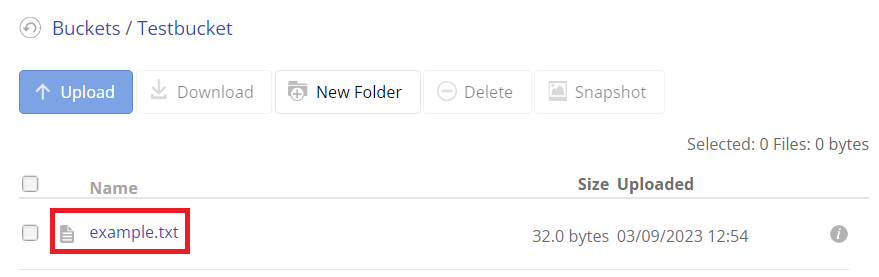

## Boto3

Boto3 is a Python library written by Amazon to interact with their cloud services. In particular, it's useful for accessing Amazon's S3 (Simple Storage Service).

<div class="notebox notebox-info">
    <p class="notebox-title">
        Note
    </p>
    <p>
        Amazon offers a free version of their S3 service, however you are required to provide a phone number and credit card to use it. There are alternative services that offer S3 compatible storage for free with no credit card required, and we created a guide on how to set one up:
    </p>
    <p>
        <a href="https://docs.oyoclass.com/cloudservices/datastores/backblaze">
            <b>Backblaze S3 Compatible Storage Service</b>
        </a>
    </p>
</div>

### Examples

In all the following examples, **you must replace all the credentials marked with pointed brackets (<>) with your own**. You can find them by following the guide linked above.

#### Add Object to Bucket

You can put all kinds of objects in an S3 bucket. For an example, let's write a simple text file to it:

```python
import boto3

s3 = boto3.resource('s3',
endpoint_url = '<YOUR ENDPOINT>',
aws_access_key_id = '<YOUR KEYID>',
aws_secret_access_key = '<YOUR ACCESS KEY>')

s3.Bucket('<YOUR BUCKET NAME>').put_object(
    Key='example.txt',
    Body='this is an example text document'
)
```

If we look at our bucket's file list, we can see that the **example.txt** is now there:



<div class="notebox notebox-info">
    <p class="notebox-title">
        Note
    </p>
    <p>
        It may take some time before this list updates and you can see it in your bucket through the web browser. We will still be able to access the file even if it's not visible yet in your account.
    </p>
</div>

#### Retrieving Object from Bucket

Now that the object exists in the bucket, we can retrieve it:

```python
import boto3

s3 = boto3.resource('s3',
endpoint_url = '<YOUR ENDPOINT>',
aws_access_key_id = '<YOUR KEYID>',
aws_secret_access_key = '<YOUR ACCESS KEY>')

obj = s3.Object('<YOUR BUCKET NAME>', 'example.txt')
obj_content = obj.get()['Body'].read().decode()
print(obj_content)
```

Output:

```text
this is an example text document
```

#### Deleting Object from Bucket

We can also delete an object stored in our bucket:

```python
import boto3

s3 = boto3.resource('s3',
endpoint_url = '<YOUR ENDPOINT>',
aws_access_key_id = '<YOUR KEYID>',
aws_secret_access_key = '<YOUR ACCESS KEY>')

obj = s3.Object('<YOUR BUCKET NAME>', 'example.txt')
obj.delete()
```

Now if we run the previous example where we try to read **example.txt**, we get the following error:

```text
botocore.errorfactory.NoSuchKey: An error occurred (NoSuchKey) when calling the GetObject operation: Key not found
```

So we know that we have successfully deleted this object.

### Reference

-   [boto3](https://boto3.amazonaws.com/v1/documentation/api/latest/index.html) at _amazonaws.com_
