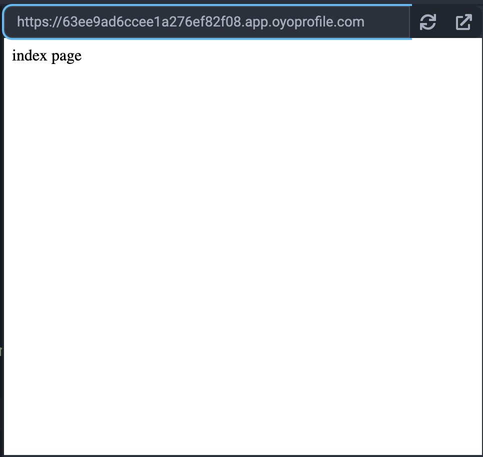
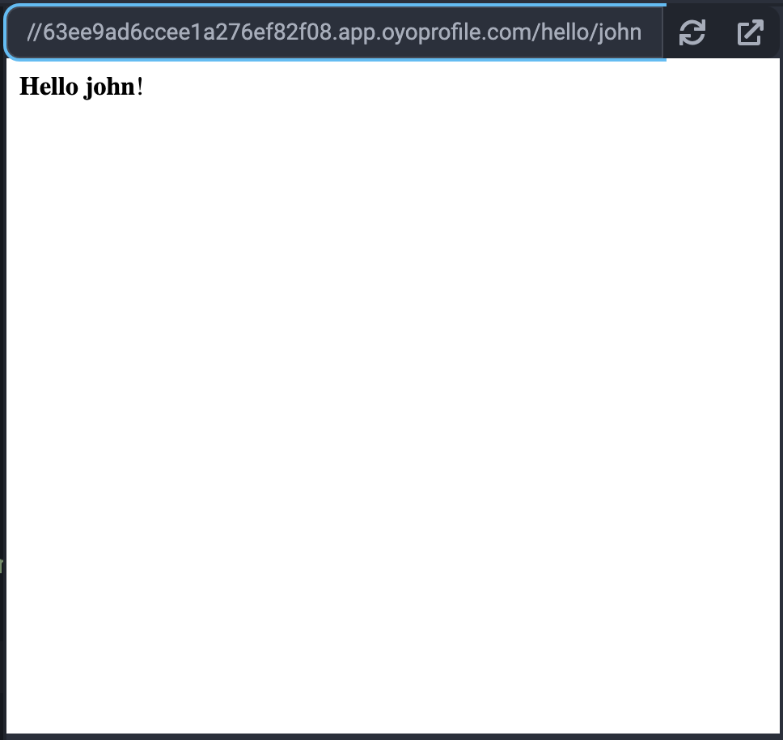

## Bottle

Bottle is an ultra-lightweight web framework that works with just the Python Standard Library. Bottle also supports html template frameworks like [Jinja2](../jinja2/) for building more robust websites.

### Examples

#### Say Hello

Let's create a simple server with two endpoints. Copy and paste the code below to the Python3 Editor:

```python
from bottle import route, run, template

@route('/')
def index():
    return 'index page'


@route('/hello/<name>')
def hello(name):
    return template('<b>Hello {{name}}</b>!', name=name)

# host must be 0.0.0.0 to work in the Python3 Editor
run(host='0.0.0.0', port=8080)
```

When you click run, you will see the website running to the right of your code.

When you visit "/", you will see a page like this:


And when you visit "/hello/john", you will see a page like this:


### Reference

-   [Bottle](https://bottlepy.org/docs/dev/) at _bottlepy.org_
