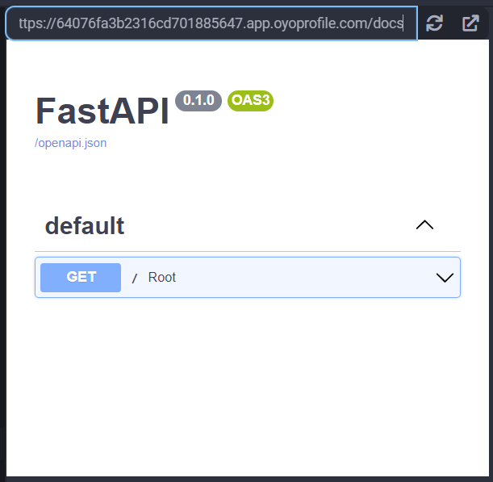
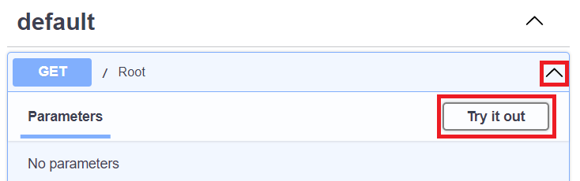
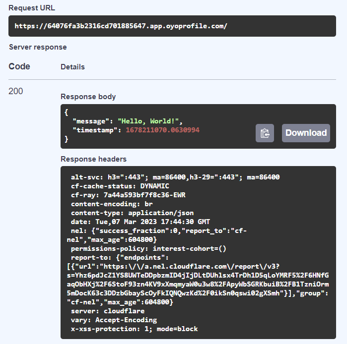
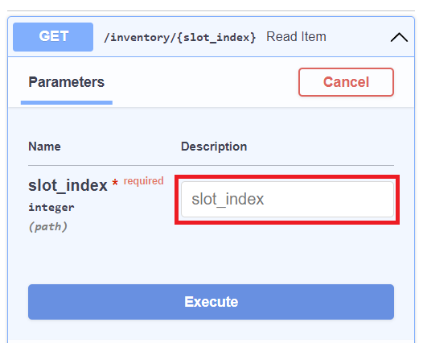
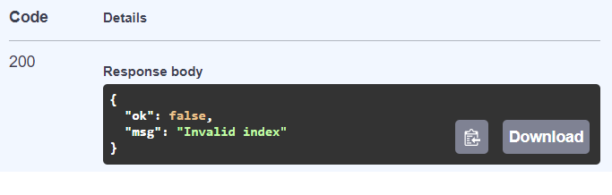
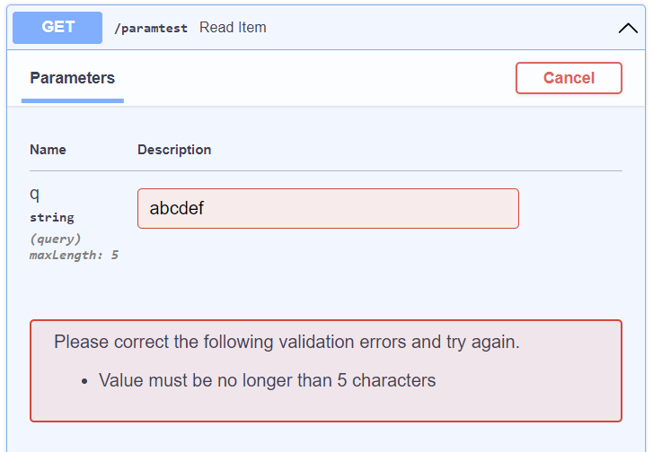

## FastAPI

FastAPI is a web framework that's designed to help programmers create API quickly and cleanly while being self-documenting. It is based on [Starlette](/extralibs/starlette/). It's made to be easy to understand and ready for production releases and is currently being used in many real-world applications by major companies like Microsoft.

<div class="notebox notebox-info">
    <p class="notebox-title">
        Note
    </p>
    <p>
        Since FastAPI is built on Starlette, an ASGI web server is needed. We will be using
        <a href="/extralibs/uvicorn/">
            <b>
                Uvicorn
            </b>
        </a>
        in the following examples, so make sure you also add the Uvicorn library to your project before trying to run the example code.
    </p>
</div>

### Examples

#### Creating a Basic API

Let's create a simple "Hello, World!" API to get a feel for how FastAPI works:

```python
import time
import uvicorn
from fastapi import FastAPI

app = FastAPI()

@app.get('/')
async def root():
    return {
        'message': 'Hello, World!,
        'timestamp': time.time()
    }

uvicorn.run(app, host='0.0.0.0', port=8000)
```

When run, we will get a window to a webpage that returns this:

```text
{"message":"Hello, World!","timestamp":1678210725.4149153}
```

While not anything special by itself, we can see that FastAPI will automatically create a **docs** page we can access and test our APIs. We can see them if we navigate to the **/docs** endpoint in our app:



From this page, click on the **Root** dropdown, and then click on **Try it out**:



Then, when you click on the **Execute** button, you will get all your request's info presented directly in this window:



#### More Robust API Definitions with Python Typehints

FastAPI really shines when, and is designed to be used with, [Python Typehints](https://docs.python.org/3/library/typing.html). Even though Python is a dynamically typed language where you don't need to assign a type (like _str_, _int_, and so on) to each variable when declaring them like Java. However, Python supports **typehints**, which is a tool for programmers to communicate what kind of variables functions are _expecting_ and what they will return.

They are optional, but can help in creating easier to understand and maintainable code. Let's see how that works with FastAPI with this example:

```python
import uvicorn
from fastapi import FastAPI

app = FastAPI()

INVENTORY = ['a', 'b', 'c', 'd', 'e']

@app.get('/inventory/{slot_index}')
async def read_item(slot_index: int):
    try:
        return {'ok': True, 'item': INVENTORY[slot_index]}
    except Exception:
        return {'ok': False, 'msg': 'Invalid index'}

uvicorn.run(app, host='0.0.0.0', port=8000)
```

When we visit a valid url like **/inventory/4**, we will get a page like this:

```text
{"ok":true,"item":"e"}
```

The useful part comes when we look at the docs again. When we click **Try it out** for this new endpoint, it comes with an input for the `slot_index` argument, where we can easily try out many values in an easy-to-use interface:



If we try with an index of **5**, we get this:



#### Argument Validation

We can use the **Query** object from FastAPI to specify a query argument, as well as put some constraints on it:

```python
import uvicorn
from fastapi import FastAPI, Query

app = FastAPI()

@app.get('/paramtest')
async def read_item(q: str | None = Query(default=None, max_length=5)):
    return {'echo': q}

uvicorn.run(app, host='0.0.0.0', port=8000)
```

Then, when we visit **/paramtest?q=abcde**, we get a page that shows this:

```text
{"echo":"abcde"}
```

If we visit the docs and try to input a query that's too long, it will render an error message for us:



### Reference

-   [FastAPI](https://fastapi.tiangolo.com/) at _tiangolo.com_
-   [Python Typehints](https://docs.python.org/3/library/typing.html) at _docs.python.org_
