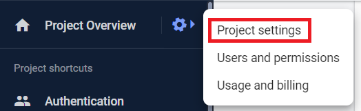
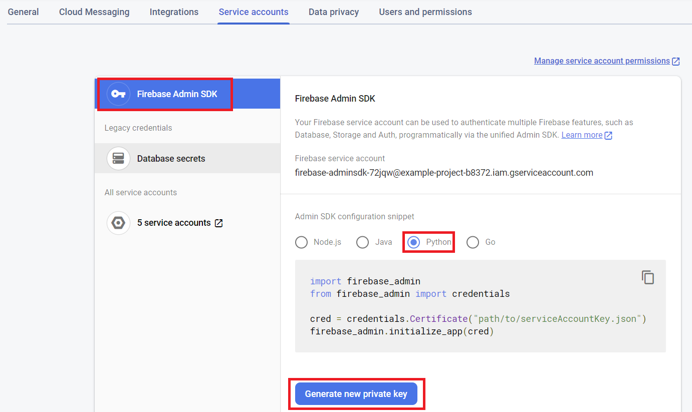
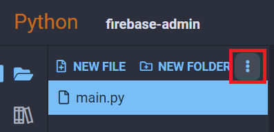
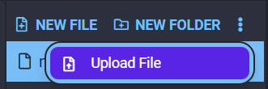
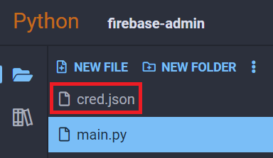
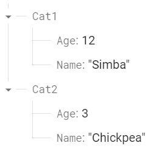

## firebase-admin

firebase-admin is a Python library that allows for accessing and interacting with Firebase projects. In particular, Firebase offers a free realtime database service that we can use to store and access data from Python3 Editor projects.

<div class="notebox notebox-info">
    <p class="notebox-title">
        Note
    </p>
    <p>
        You need to have an active Google account and project on Firebase to use this package. For a guide on how to set one up with a realtime database activated, check our cloud services guide to Firebase:
    </p>
    <p>
        <a href="https://docs.oyoclass.com/cloudservices/datastores/firebase">
            <b>
                Free Google Account and Firebase Setup
            </b>
        </a>
    </p>
</div>

<div class="notebox notebox-danger">
    <p class="notebox-title">
        Warning
    </p>
    <p>
        When including private database credentials in your code, make sure you <b>DO NOT</b> make your project <b>"Open Source"</b> when you share it.
    </p>
</div>

### Connecting to Your Realtime Database

To use this library, **you must have an active and setup Firebase account with a realtime database set up**. You can create one and set it up following the guide linked above.

#### Downloading Your Credentials JSON

First, go to the left side of the Firebase UI and find the gear icon next to the **Project Overview** label. Then, click on **Project settings**:



From there, click on the **Service Accounts** tab on the top, make sure **Firebase Admin SDK** is selected, then click on **Generate new private key**. This will download a `.json` file that we will need to upload to the Python3 Editor:



<div class="notebox notebox-info">
    <p class="notebox-title">
        Note
    </p>
    <p>
        <b>Do not share this file with anybody else.</b> It would give them full access to your database in a way you cannot control.
    </p>
</div>

#### Uploading Your Credentials JSON to Your Project

At the top of your project's file list in Python3 Editor, click on the dropdown menu and select **Upload File**:





Find the credentials file in your computer's file browser, and we can rename it to **cred.json**:



### Examples

In all the following examples, **you must have a credentials JSON file uploaded to your project somewhere**. To keep it simple, we're using a file named **cred.json** in our project's root path.

#### Creating a Document

Let's create a couple of documents to insert into our Firebase. We can add documents in dictionary form:

```python
import firebase_admin
from firebase_admin import db

cred_obj = firebase_admin.credentials.Certificate('cred.json')
default_app = firebase_admin.initialize_app(cred_obj, {
	'databaseURL': 'https://<YOUR DATABASE URL>.firebaseio.com/'
})
ref = db.reference('/')

data = {
    "Cat1": {
        "Name": 'Simba',
        "Age": 12
    },
    "Cat2": {
        "Name": 'Chickpea',
        "Age": 3
    }
}
ref.set(data)
```

If we look at our Firebase now, we can see the data has been inserted:



#### Reading a Document

We can retrieve our data with the db reference's `get()` method:

```python
import firebase_admin
from firebase_admin import db

cred_obj = firebase_admin.credentials.Certificate('cred.json')
default_app = firebase_admin.initialize_app(cred_obj, {
	'databaseURL': 'https://<YOUR DATABASE URL>.firebaseio.com/'
})
ref = db.reference('/')

cat1 = ref.get()['Cat1']
print(cat1)
```

Output:

```text
{'Age': 12, 'Name': 'Simba'}
```

#### Updating a Document

We can update a document key by using a reference's `update()` method:

```python
import firebase_admin
from firebase_admin import db

cred_obj = firebase_admin.credentials.Certificate('cred.json')
default_app = firebase_admin.initialize_app(cred_obj, {
	'databaseURL': 'https://<YOUR DATABASE URL>.firebaseio.com/'
})

# We only want to update Cat1
cat1_ref = db.reference("/Cat1")

# Before read
print(cat1_ref.get())

# Perform update
data = {
    'Age': 13
}
cat1_ref.update(data)

# After read
print(cat1_ref.get())
```

Output:

```text
{'Age': 12, 'Name': 'Simba'}
{'Age': 13, 'Name': 'Simba'}
```

#### Deleting a Document

Finally, we can delete a document by calling the `delete()` method on a reference to it:

```python
import firebase_admin
from firebase_admin import db

cred_obj = firebase_admin.credentials.Certificate('cred.json')
default_app = firebase_admin.initialize_app(cred_obj, {
	'databaseURL': 'https://example-project-b8372-default-rtdb.firebaseio.com/'
})

cat1_ref = db.reference("Cat1")  # Get our Cat1
print(cat1_ref.get())  # Print it out
cat1_ref.delete()  # Delete from Firebase
print(cat1_ref.get())  # Try to read it again
```

Output:

```text
{'Age': 13, 'Name': 'Simba'}
None
```

### Reference

-   [Firebase Admin Python SDK](https://firebase.google.com/docs/reference/admin/python) at _firebase.google.com_
