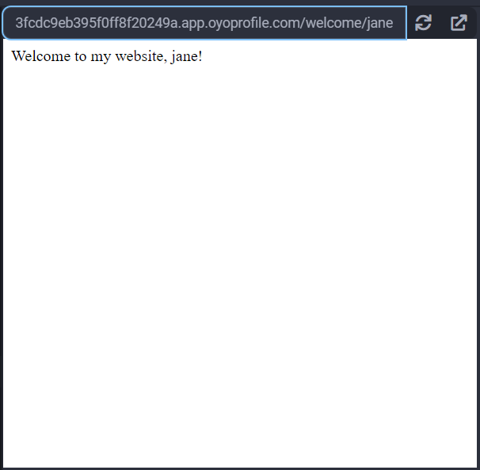

## flask

flask is a micro web framwork. flask is similar to <a href="/extralibs/bottle/">bottle</a>,
but it has more functionality out of the box and scales easier. flask is better
suited for larger projects that can span across mulitple Python files.


### Example

#### Basic Web Server with Templates

1\. flask will look for template files in the `templates` directory by default, so
first, create a new folder named `templates`, then add a file named `welcome.html`:
```html
<!DOCTYPE html>
<html>
    <head>
    </head>
    <body>
        Welcome to my website, {{name}}!
    </body>
</html>
```
2\. Copy and paste the below code to `main.py`:
```python
from flask import Flask

app = Flask(__name__)

if __name__ == '__main__':
    # host must be 0.0.0.0 to work in the Python3 Editor
    import example_routes
    app.run(host='0.0.0.0', port=8080)
```
3\. Create a 2nd python file named `example_routes.py`:
```python
from flask import render_template
from __main__ import app

@app.route('/')
def index():
    return 'This is the index page'

@app.route('/welcome/<name>')
def welcome(name):
    return render_template(
        'welcome.html',
        name=name
    )
```


When you visit "/", you will see a page like this:


And when you visit "/welcome/jane", you will see a page like this:


Read more at <a href="https://flask.palletsprojects.com/en/2.2.x/">flask.palletsprojects.com</a>