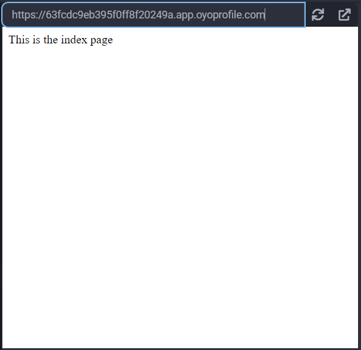

## Flask

Flask is a micro web framework. Flask is similar to [Bottle](../bottle/), but it has more functionality out of the box and scales easier. Flask is better suited for larger projects that can span across multiple Python files.

### Example

#### Say Hello

Let's create a simple server using Flask. This creates a server that says "Welcome to Flask!" when visiting the index page:

```python
from flask import Flask

app = Flask(__name__)

@app.route('/')
def index():
    return 'Welcome to Flask!'

if __name__ == '__main__':
    # host must be 0.0.0.0 to work in the Python3 IDE
    app.run(host='0.0.0.0', port=8080)
```

When we run our code, we get the folllowing output:


#### Basic Web Server with Templates

Flask will look for template files in the `templates` directory by default, so first, create a new folder named `templates`, then add a file named `welcome.html`.

To create a folder in your project, click on **NEW FOLDER** at the top of your project's file list:


Then, name it "templates" in the window that pops up:


Add a new file to your project and name it `welcome.html`. Paste the following HTML into the file, then put it inside of the `templates` folder that we just created:

```html
<!DOCTYPE html>
<html>
    <head>
    </head>
    <body>
        Welcome to my website, {{name}}!
    </body>
</html>
```

Your project's file list should look like this when you are done:


Now that we have a template in our templates folder, copy and paste the below code to `main.py`:

```python
from flask import Flask, render_template

app = Flask(__name__)

@app.route('/')
def index():
    return 'This is the index page'

@app.route('/welcome/<name>')
def welcome(name):
    return render_template(
        'welcome.html',
        name=name
    )

if __name__ == '__main__':
    # host must be 0.0.0.0 to work in the Python3 IDE
    app.run(host='0.0.0.0', port=8080)
```

When you visit "/", you will see a page like this:


And when you visit "/welcome/jane", you will see a page like this:


### Reference

-   [Flask](https://flask.palletsprojects.com/en/2.2.x/) at _flask.palletsprojects.com_
