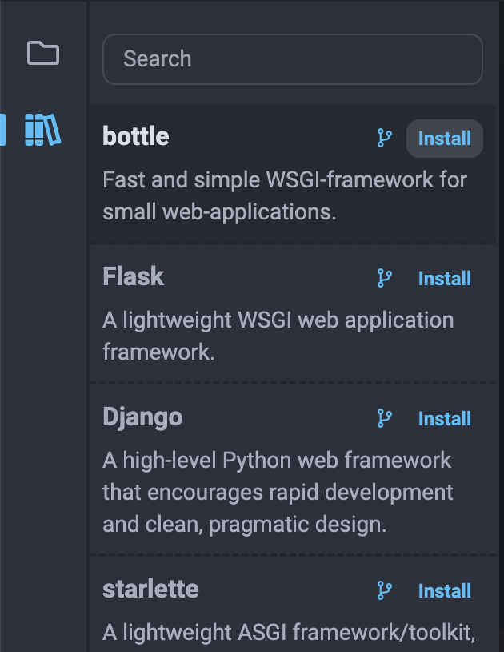

## 3rd-party Python Libraries

OYOclass' Python3 IDE also provides some extra libraries you can install and use.

To find and install these libraries, you can simply click the "library" icon on the left. Once you find the library you want to use, you can just click "Install" in the corner:

