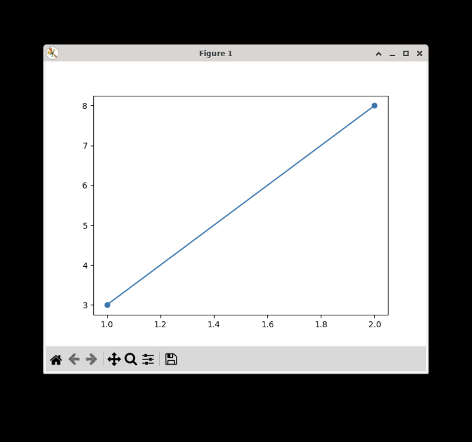
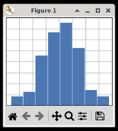

## Matplotlib

Matplotlib is a library for creating various data visualizations in Python. You can render many different kinds of graphs and charts with a simple interface. This library works closely with [NumPy](/extralibs/numpy/) to handle its datasets.

### Examples

#### Plot a Simple Line

Let's make a basic straight line segment graph:

```python
import matplotlib.pyplot as plt
# define the 1st point's coordinate (x=1, y=2)
pt1 = [1, 2]
# define the 2nd point's coordinate (x=3, y=8)
pt2 = [3, 8]
# draw a line from point1 to point2, also mark these 2 points
plt.plot(pt1, pt2, marker='o')
plt.show()
```

Output:



#### Plot a Histogram

```python
import matplotlib.pyplot as plt
import numpy as np

plt.style.use('_mpl-gallery')

np.random.seed(1)  # set random seed
x = 4 + np.random.normal(0, 1.5, 200)  # Create a random normal distribution

# plot:
fig, ax = plt.subplots()

ax.hist(x, bins=8, linewidth=0.5, edgecolor="white")  # Create histogram

ax.set(xlim=(0, 8), xticks=np.arange(1, 8),
       ylim=(0, 56), yticks=np.linspace(0, 56, 9))  # Set legend constraints

plt.show()
```

Output:



### Reference

-   [Matplotlib](https://matplotlib.org/stable/index.html) at _matplotlib.org_
