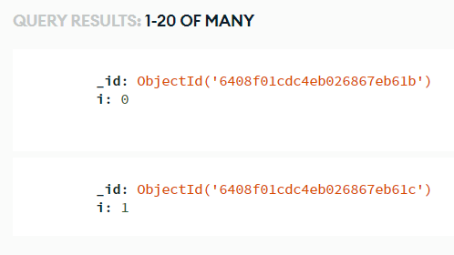

## Motor

Motor is an asyncio driver for MongoDB databases in Python.

<div class="notebox notebox-info">
    <p class="notebox-title">
        Note
    </p>
    <p>
        This package assumes you already know how to create a Mongo database and connect to it with Python3 Editor. If you don't know how to do this, follow the "Setting Up Your Database" section of the
        <a href="../pymongo/#setting-up-your-database">
            <b>PyMongo</b>
        </a>
        documentation.
    </p>
</div>

### Examples

#### Using the asyncio Client

Since motor is an async package, we need to perform database operations in async functions. Let's make a simple function that inserts 50 documents into a collection in our database:

_Make sure you replace the mongodb server url with the one from your cloud MongoDB_

```python
import asyncio
import motor.motor_asyncio

client = motor.motor_asyncio.AsyncIOMotorClient("mongodb+srv://testuser:<password>@<your cluster>.mongodb.net/?retryWrites=true&w=majority")
db = client.test_database

async def do_insert():
    result = await db.test_collection.insert_many(
        [{'i': i} for i in range(50)]
    )
    print(f'inserted {len(result.inserted_ids)} docs')

loop = client.get_io_loop()
loop.run_until_complete(do_insert())
```

We run it and will get the output:

```text
inserted 50 docs
```

If we check out Mongo Atlas, we will see a list of all the documents we inserted to confirm the operation succeeded:



### Reference

-   [Motor](https://motor.readthedocs.io/en/stable/index.html) at _readthedocs.io_
