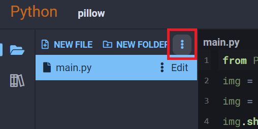
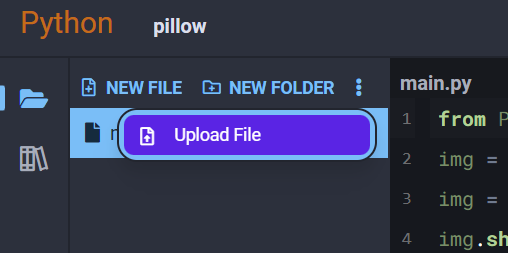
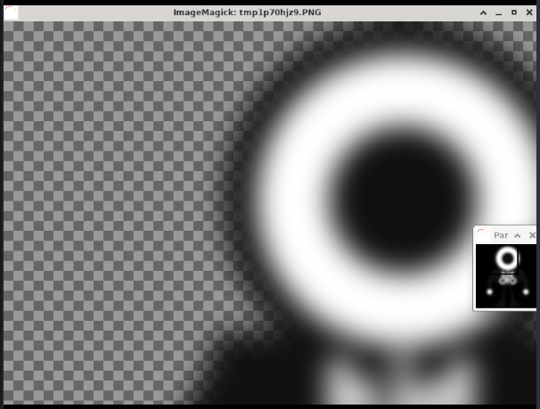

## Pillow

Pillow is an image processing library for Python. It enables you to load pictures for viewing and editing, perform transformations, and apply filters to them.

### Examples

#### Upload an Image to Your Project

The first thing we need to do to use this package is have an image to work with. We're going to use an image of OYObot in the following examples, <a download="oyobot.png" href="../../assets/img/oyobot.png" title="Download image">click here</a> to download a copy.

After it's downloaded, open up the Python3 Editor and select **Upload File** from the dropdown at the top of your project's file list:





Find the picture you downloaded in your file browser, then confirm the upload was successful by finding the image in your project's file list:


#### Get Image Info

Pillow is able to read metadata from an image it opens, and provide phsyical properties like its dimensions and format:

```python
from PIL import Image
img = Image.open('oyobot.png')

# print out image info
print(f'filename: {img.filename}')
print(f'dimensions: {img.width}x{img.height}')
print(f'format: {img.format}')
```

Output:

```text
filename: oyobot.png
dimensions: 1200x1200
format: PNG
```

#### Render Image

We can render the image by calling the `show()` method of the image:

```python
from PIL import Image
img = Image.open('oyobot.png')
img.show()
```

You will get an ImageMagick window rendered to the right of your code that looks like this:


You can use your mouse and keyboard to interact with this window. The second smaller window allows you to pan around the image by clicking and dragging since it will most likely be too big to fit on one screen.

#### Apply a Filter to an Image

We can also use Pillow to apply various filters and transforms to images. Here's a simple example where we apply a gaussian blur to our OYObot picture:

```python
from PIL import Image, ImageFilter
img = Image.open('oyobot.png')
img = img.filter(ImageFilter.GaussianBlur(20))
img.show()
```

You will get an ImageMagick window rendered to the right of your code that looks like this:



### Reference

-   [Pillow](https://pillow.readthedocs.io/en/stable/) at _pillow.readthedocs.io_
