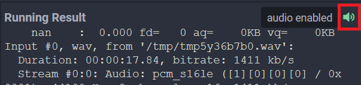

## Pydub

Pydub is a Python library that allows you to edit audio files with a simple interface.

<div class="notebox notebox-info">
  <p class="notebox-title">
    Note
  </p>
  <p>
    Since this library uses sounds, you will need to upload your own music or music loop. For a quick sample, you can create an account on a website like 
    <a href="https://samplefocus.com/">
      <b>SampleFocus</b>
    </a> 
    and grab a royalty free sample.
  </p>
</div>

### Examples

#### Upload a Sound to Your Project

The first thing we need to do to use this package is have a sound to work with. We're going to use a sound obtained from a sample library, [click here](https://samplefocus.com/) and make an account to download a sample or you can upload a song you already have on your computer.

After it's downloaded, open up the Python3 Editor and select Upload File from the dropdown at the top of your project's file list:


Find the sound you want to upload in your file browser, then confirm the upload was successful by finding the sound in your project's file list:


#### Get Sound Info

Similar to images with [Pillow](../pillow), we can use Pydub to extract and print information about audio files:

```python
from pydub.utils import mediainfo
import os
info = mediainfo('riff-loop.wav')

print('Filename:', info['filename'])
print('Format:', info['format_name'])
print('Sample Rate:', info['sample_rate'])
print('File Size:', int(info['size']), "bytes")
```

Output:

```text
Filename: riff-loop.wav
Format: wav
Sample Rate: 44100
File Size: 3146306 bytes
```

#### Play a Sound

Run the following code and your program will begin playing audio:

<div class="notebox notebox-info">
  <p class="notebox-title">
    Note
  </p>
  <p>
    make sure your file format matches the file you uploaded. If you uploaded an mp3, make sure you change the format to <code>"mp3"</code>
  </p>
</div>

```python
from pydub import AudioSegment
from pydub.playback import play

sound = AudioSegment.from_file('riff-loop.wav', format='wav')
play(sound)
```

Your output should look similar to this:

```text
nan    :  0.000 fd=   0 aq=    0KB vq=    0KB Input #0, wav, from '/tmp/tmpxyn846ga.wav':
  Duration: 00:00:17.84, bitrate: 1411 kb/s
  Stream #0:0: Audio: pcm_s16le ([1][0][0][0] / 0x0001), 44100 Hz, 2 channels, s16, 1411 kb/s
   0.02 M-A:  0.000 fd=   0 aq=  176KB vq=    0KB
   0.05 M-A:  0.000 fd=   0 aq=  176KB vq=    0KB
   0.08 M-A:  0.000 fd=   0 aq=  176KB vq=    0KB
   0.11 M-A:  0.000 fd=   0 aq=  176KB vq=    0KB
   0.14 M-A:  0.000 fd=   0 aq=  176KB vq=    0KB
   ...
```

This is the raw text output of processing the audio stream. To actually hear the audio, you must click on the speaker icon on the top right of your running project:


You know if audio was successfully enabled if the speaker icon changes and turns green:



#### Modify a Sound

Every time you modify a sound, it creates a new **AudioSegment**. Let's try a basic edit where we reverse our sound:

```python
from pydub import AudioSegment
from pydub.playback import play

sound = AudioSegment.from_file('riff-loop.wav', format='wav')
reversed_sound = sound.reverse()  # need to store edit in new variable
play(reversed_sound)
```

The output will be similar to the previous example, except now the audio file will be playing in reverse.

### Reference

-   [Pydub](https://pydub.com/) at _pydub.com_
-   [Pydub API Reference](https://github.com/jiaaro/pydub/blob/master/API.markdown) at _github.com_
