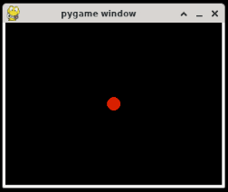

## Pygame

Pygame is a collection of Python modules for creating video games. It provides access to keyboard and mouse inputs, rendering images, playing sounds, and more. The main draw of Pygame, especially for learners, is the ease of use without the need to install bulky full featured or enterprise level game engines like Unreal or Unity.

### Examples

#### Run Built-in Aliens Demo Game

```python
import pygame.examples.aliens
pygame.examples.aliens.main()
```

You will get a game window open to the right of your code, you can use the left and right arrow keys to move, and space to shoot:


#### Keyboard Controls

```python
import sys
import pygame
pygame.init()

size = width, height = 320, 240
black = (0, 0, 0)
red = (255, 0, 0)

screen = pygame.display.set_mode(size)
circle_x = width//2
circle_y = height//2
radius = 10

while True:
    for event in pygame.event.get():
        if event.type == pygame.QUIT:
            sys.exit()
        elif event.type == pygame.KEYDOWN:
            if event.key == pygame.K_LEFT:
                circle_x -= 10
            elif event.key == pygame.K_RIGHT:
                circle_x += 10
            elif event.key == pygame.K_UP:
                circle_y -= 10
            elif event.key == pygame.K_DOWN:
                circle_y += 10

    screen.fill(black)
    pygame.draw.circle(screen, red, (circle_x, circle_y), radius)
    pygame.display.flip()
```

You will get a game window open to the right of your code, you can use the arrow keys to move the ball up, down, left, and right:


