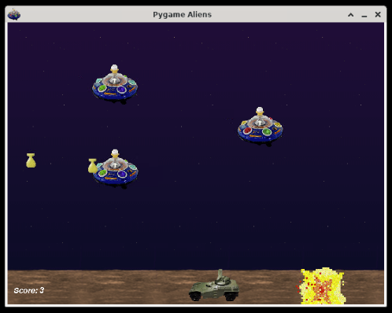

## Pygame

Pygame is a collection of Python modules for creating video games. It provides access to keyboard and mouse inputs, rendering images, playing sounds, and more. The main draw of Pygame, especially for learners, is the ease of use without the need to install bulky full featured or enterprise level game engines like Unreal or Unity.

### Examples

#### Run Built-in Aliens Demo Game

Pygame has several built in demos that we can try running simply by importing them from the library's builtin **examples** package. Let's try running the _aliens_ demo:

```python
import pygame.examples.aliens
pygame.examples.aliens.main()
```

You will get a game window open to the right of your code, you can use the left and right arrow keys to move, and space to shoot:



You can try out the other example projects too. You can find a list of them at the official [Pygame Examples Reference](https://www.pygame.org/docs/ref/examples.html)

#### Keyboard Controls

Creating your own game requires we do a bit more than calling a single function. In the following example, we will create a simple game where you can move a small red ball around the screen with the arrow keys. Included are comments that explain what each section of the code is doing:

```python
import sys
import pygame

# You must call pygame.init() before anything else
pygame.init()

# Many Pygame methods take tuples as arguments, so we will save the desired
# screen width and height (in pixels) into a tuple named "size" to make our
# code more readable
width, height = 640, 480
size = (width, height)

# The screen variable is how we will render graphics to the screen
screen = pygame.display.set_mode(size)

# Colors are in tuples of (RED, GREEN, BLUE)
black = (0, 0, 0)
red = (255, 0, 0)

# Start the circle in the middle of the screen
circle_x = width//2
circle_y = height//2
radius = 10

# We will use an infinite "while True" loop to only force exit our game once
# the pygame.QUIT event is fired (like pressing the escape key)
while True:
    # Check pygame events every frame to process player's inputs
    for event in pygame.event.get():
        if event.type == pygame.QUIT:
            sys.exit()
        elif event.type == pygame.KEYDOWN:
            if event.key == pygame.K_LEFT:
                circle_x -= 10
            elif event.key == pygame.K_RIGHT:
                circle_x += 10
            elif event.key == pygame.K_UP:
                circle_y -= 10
            elif event.key == pygame.K_DOWN:
                circle_y += 10

    # Cover the previous frame with a plain black background
    screen.fill(black)
    # Draw the circle at its current X and Y position
    pygame.draw.circle(screen, red, (circle_x, circle_y), radius)

    # the display.flip() function takes all the changes we made to the screen
    # and actually displays the changes to the player
    pygame.display.flip()
```

You will get a game window open to the right of your code, you can use the arrow keys to move the ball up, down, left, and right:


### References

-   [Pygame](https://www.pygame.org/docs/) at _pygame.org_
    -   In particular, the [Newbie Guide](https://www.pygame.org/docs/tut/newbieguide.html) section is a good thing to read if you've never used Pygame before, and has some good tips for game development in general
