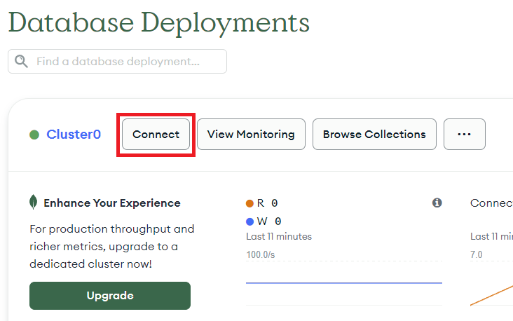
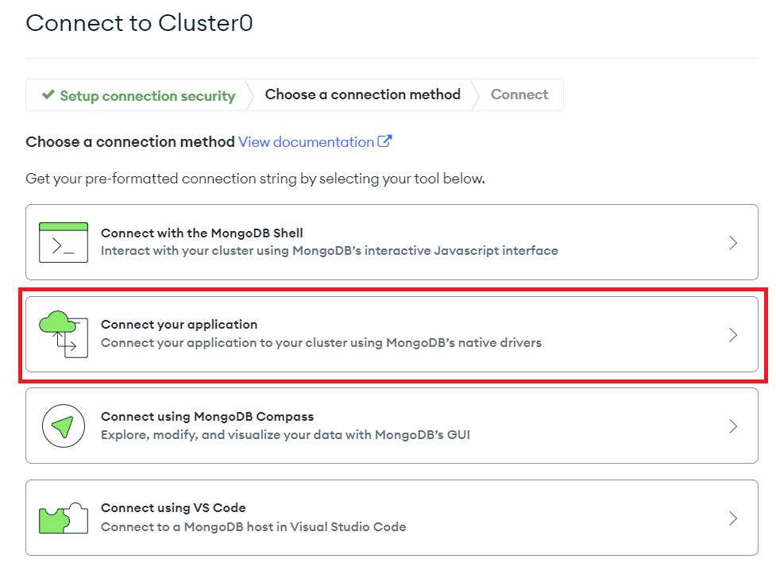
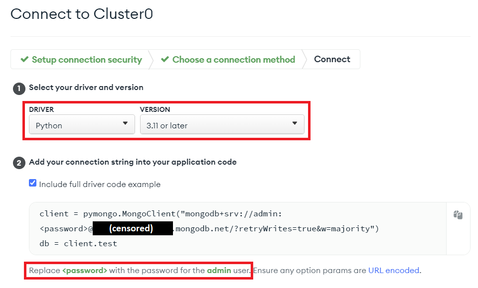
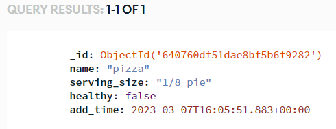
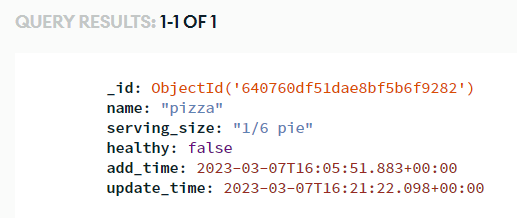

## PyMongo

PyMongo is a Python library that provides an interface for using MongoDB. MongoDB is a **NoSQL** database, which means **it does not use Structured Query Language** like [SQLite](../../modules/sqlite/). MongoDB is useful for an easy to understand database interface without the rigidity a traditional relational SQL database may have.

<div class="notebox notebox-info">
    <p class="notebox-title">
        Note
    </p>
    <p>
        Python3 IDE does not provide access to a locally running Mongo database. You can, however, connect to a Mongo cloud database using the Python3 IDE. Mongo provides a free tier for their cloud database service and you can get one by making an account with them.
    </p>
    <p>
        We have written a short guide on how to properly set up a Mongo cloud instance to work with Python3 IDE. You can check it out here:
    </p>
    <p>
        <a href="https://docs.oyoclass.com/cloudservices/datastores/mongo">
            <b>
                MongoDB Free Cloud Database
            </b>
        </a>
    </p>
</div>

<div class="notebox notebox-danger">
    <p class="notebox-title">
        Warning
    </p>
    <p>
        When including private database credentials in your code, make sure you <b>DO NOT</b> make your project <b>"Open Source"</b> when you share it.
    </p>
</div>

### Connecting to Your Database

Before we can write or read anything to our new cloud database, we need to actually have our code connect to it. Mongo provides a pre-built connection URL that you can copy and paste into your code. To find this URL, do the following:

1\. Find your cloud cluster, and click the **Connect** button:



2\. Click on **Connect your application** in the window that pops up:


3\. Select **Python** and **3.11 or later** in the dropdowns, and follow the directions about replacing **<password\>** in the provided URL with the password you chose when setting up your cluster's user account:



After you do all that, you can finally paste the code provided into Python3 Editor and test your connection with the database:

<div class="notebox notebox-info">
    <p class="notebox-title">
        Note
    </p>
    <p>
        For this example and all the following examples, they will provide dummy database URLs that you must replace with the one provided by your Mongo cloud instance.
    </p>
</div>

```python
import pymongo

client = pymongo.MongoClient("mongodb+srv://testuser:<password>@<your cluster>.mongodb.net/?retryWrites=true&w=majority")

# this will fail if the provided URL or database has a problem
client.server_info()
print("Database connected successfully")
```

If you have done everything correctly, then congratulations! You have successfully created and connected to a MongoDB cloud instance properly configured to work with the Python3 Editor.

### Examples

#### Create a New Document

Now that we have a database up and running, it's time to actually use it! Let's begin by inserting a document into our database:

```python
import datetime
import pymongo

client = pymongo.MongoClient("mongodb+srv://testuser:<password>@<your cluster>.mongodb.net/?retryWrites=true&w=majority")
# Use a database we named "health". If the desired database doesn't exist, it
# will automatically be created for us.
health_db = client.health

# In the "health database", use a collection named "food". This will also be
# created for us if it doesn't exist
food_collection = health_db.food

new_food = {
    "name": "pizza",
    "serving_size": "1/8 pie",
    "healthy": False,
    "add_time": datetime.datetime.utcnow()
}

food_id = food_collection.insert_one(new_food).inserted_id
print(food_id)
```

Output:

```text
640760df51dae8bf5b6f9282
```

Every document inserted is automatically given an **\_id** field even if we don't give it one. We can see the full document if we look at our database in Mongo Atlas:



#### Read an Existing Document

Once we have a piece of data in our database, we can read from it by making queries:

```python
import pprint
import pymongo

client = pymongo.MongoClient("mongodb+srv://testuser:<password>@<your cluster>.mongodb.net/?retryWrites=true&w=majority")
health_db = client.health
food_collection = health_db.food

query_cond = {
    "name": "pizza"
}
food_item = food_collection.find_one(query_cond)
pprint.pprint(food_item)
```

Output:

```text
{'_id': ObjectId('640760df51dae8bf5b6f9282'),
 'add_time': datetime.datetime(2023, 3, 7, 16, 5, 51, 883000),
 'healthy': False,
 'name': 'pizza',
 'serving_size': '1/8 pie'}
```

#### Update an Existing Document

We can change a document already in our database with an update query. Let's update our pizza entry to increase the serving size, and add an `update_time` field:

```python
import datetime
import pymongo

client = pymongo.MongoClient("mongodb+srv://testuser:<password>@<yourcluster>.mongodb.net/?retryWrites=true&w=majority")
health_db = client.health
food_collection = health_db.food

query_cond = {
    "name": "pizza"
}
update_data = {
    "$set": {
        "serving_size": "1/6 pie",
        "update_time": datetime.datetime.utcnow()
    }
}
food_item = food_collection.update_one(query_cond, update_data)
```



#### Delete a Document

Finally, let's get rid of the pizza document altogether. We can do this with a delete query:

```python
import pymongo

client = pymongo.MongoClient("mongodb+srv://testuser:<password>@<yourcluster>.mongodb.net/?retryWrites=true&w=majority")
health_db = client.health
food_collection = health_db.food

delete_cond = {
    "name": "pizza"
}
food_item = food_collection.delete_one(delete_cond)
```

If we check our database now, we can see that this collection is now fully empty since we deleted the only document from it.

### Reference

-   [PyMongo](https://pymongo.readthedocs.io/en/stable/) at _readthedocs.io_
-   [MongoDB User Manual](https://www.mongodb.com/docs/v5.0/) at _mongodb.com_
