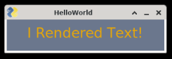
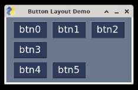
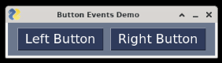

## PySimpleGUI

PySimpleGUI is a meta-library, as in it combines several other GUI libraries into one single package with a common programming interface. This increases your options and gives you less things to think about when building a GUI with Python.

### Examples

#### Rendering Text

First thing we will do is simply get a window with text rendered on it. All PythonSimpleGUI projects will have a similar structure where we will define elements, put them in a layout list, then render them to a window:

```python
import PySimpleGUI as pg

# Create a text layout element
hello_world_text_element = pg.Text(
    text='I Rendered Text!',  # What the text will say
    font=('Arial Bold', 20),  # Which font and size to use
    text_color='orange',  # Color for the text
    justification='center'  # Center the text element
)

# Create a layout of one row, with one element
layout = [[hello_world_text_element]]

# Create a window to render the layout on
window = pg.Window('HelloWorld', layout)

# Keep the window open forever until we close it manually
while True:
    # Read if there's any event every loop
    event, values = window.read()
    if event in (None, 'Exit'):
        break

window.close()
```

To the right of your code, you will see a window that looks like this, which will remain open until you click the "**x**" on the window:



#### Understanding the Layout List

The layout that we need to give to the window is a **list of lists**. We can create lists to describe how we want our elements rendered in the window, like this:

```python
layout = [
    [elem1, elem2, elem3],
    [elem4],
    [elem5, elem6]
]
```

This would create a window with three rows. The first row would contain elems 1, 2, and 3. The second would contain only elem 4, and the final row would contain elems 5 and 6. Let's create another simple demo to see this in action:

```python
import PySimpleGUI as pg

# Create several buttons
btns = []
btn_font = ('Arial Black', 16)
for i in range(6):
    btns.append(pg.Button(f'btn{i}', font=btn_font))

# Create the layout like above, a list of three lists
layout = [
    [btns[0], btns[1], btns[2]],
    [btns[3]],
    [btns[4], btns[5]]
]
window = pg.Window('Button Layout Demo', layout)

while True:
    event, values = window.read()
    if event in (None, 'Exit'):
        break

window.close()
```

Then, we can see the window rendered like we expect:



#### Handling Button Events

Buttons wouldn't be much use if we can't detect when and which button was clicked. The following example creates two buttons and prints a different message when each one is clicked:

```python
import PySimpleGUI as pg

# Create a layout of two buttons
font = ('Arial Black', 16)
layout = [
    [pg.Button('Left Button', font=font), pg.Button('Right Button', font=font)]
]
window = pg.Window('Button Events Demo', layout)

while True:
    event, values = window.read()

    # We will check for the button event here.
    # The event will be the same as the button's text
    if event in (None, 'Exit'):
        break
    elif event == 'Left Button':
        print('Left button clicked!')
    elif event == 'Right Button':
        print('Right button clicked!')

window.close()
```

Rendered on the right:



Then each time when we click each button, we will see our print message appear in the console below the running project:

```text
Left button clicked!
Left button clicked!
Right button clicked!
Left button clicked!
```

#### Customizing Events

By default, the event that is fired by the button is the same as its text. If you wanted this to be different, you can pass a string to your button as the keyword argument **key** like this:

```python
pg.Button('very long button text that would be too long to repeat', key='short')
```

Now, the event fired by this button will now be `'short'` instead of the button's text.

### Reference

-   [PySimpleGUI](https://www.pysimplegui.org/en/latest/) on _pysimplegui.org_
    -   The [PySimpleGUI Cookbook Section](https://www.pysimplegui.org/en/latest/cookbook/) has good tips on patterns of designing several common GUI situations and how to handle them with example code
