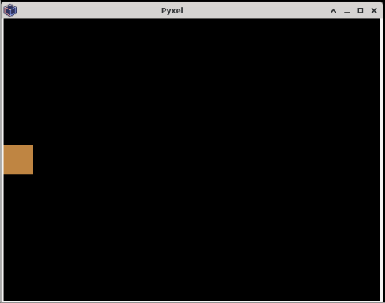

## Pyxel

Pyxel is a retro game engine made for Python. There are some intentional limitations to the game engine, such as only being allowed to display 16 colors on the screen at any given time and only 4 sounds can be played simultaneously.

These limitations are meant to help games made in it stay true to the retro-gaming era the library is aiming at recreating, and it can also be a good exercise in keeping your projects small and focused.

### Examples

#### Drawing an Object on the Screen

Let's draw a basic square on the screen and make it constantly move to the right:

```python
import pyxel

class App:
    def __init__(self):
        # Initialize the screen
        self.screen_width = 640
        self.screen_height = 480
        pyxel.init(self.screen_width, self.screen_height)

        # Initialize some variables for our box
        self.width = 50
        self.height = 50
        self.x = 0
        self.y = self.screen_height//2 - self.height//2
        self.x_speed = 10

        # Tell pyxel to run with our update and draw functions
        pyxel.run(self.update, self.draw)

    def update(self):
        self.x = (self.x + self.x_speed) % pyxel.width

    def draw(self):
        # pyxel.cls(0) clears the previous frame
        pyxel.cls(0)

        # This draws a rectangle on the screen
        pyxel.rect(self.x, self.y, self.width, self.height, 9)

App()
```


#### Getting User Input

Let's add some basic controls to our game. Let's make that square move with the keyboard:

```python
import pyxel

class App:
    def __init__(self):
        # Initialize the screen
        self.screen_width = 640
        self.screen_height = 480
        pyxel.init(self.screen_width, self.screen_height)

        # Initialize some variables for our box
        self.width = 50
        self.height = 50
        self.x = 0
        self.y = self.screen_height//2 - self.height//2
        self.x_speed = 10
        self.y_speed = 10

        # Tell pyxel to run with our update and draw functions
        pyxel.run(self.update, self.draw)

    def get_player_movement(self):
        x_vel = 0
        y_vel = 0
        if pyxel.btn(pyxel.KEY_LEFT):
            x_vel -= self.x_speed
        if pyxel.btn(pyxel.KEY_RIGHT):
            x_vel += self.x_speed
        if pyxel.btn(pyxel.KEY_UP):
            y_vel -= self.y_speed
        if pyxel.btn(pyxel.KEY_DOWN):
            y_vel += self.y_speed

        return x_vel, y_vel

    def update(self):
        x_vel, y_vel = self.get_player_movement()
        self.x = (self.x + x_vel) % pyxel.width
        self.y = (self.y + y_vel) % pyxel.height

    def draw(self):
        pyxel.cls(0)

        pyxel.rect(self.x, self.y, self.width, self.height, 9)

App()
```

We can now move our box freely around with the arrow keys:



### Reference

-   [Pyxel README](https://github.com/kitao/pyxel/blob/main/README.md) at _github.com_
