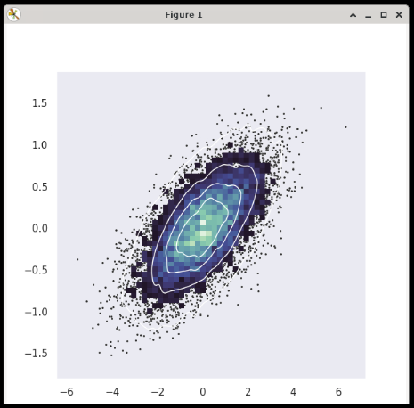

## Seaborn

Seaborn is a data visualization library for Python built on top of [Matplotlib](../matplotlib/), and works well with [pandas](../pandas/) dataframes.

### Examples

<div class="notebox notebox-info">
    <p class="notebox-title">
        Note
    </p>
    <p>
        The following examples are taken from Seaborn's official documents and uses sample data included in the package.
    </p>
</div>

#### Lineplot

```python
import matplotlib.pyplot as plt
import seaborn as sns
sns.set_theme(style="darkgrid")

# Load an example dataset with long-form data
fmri = sns.load_dataset("fmri")

# Plot the responses for different events and regions
sns.lineplot(x="timepoint", y="signal",
             hue="region", style="event",
             data=fmri)

plt.show()
```

Output:


#### Scatterplot

```python
import matplotlib.pyplot as plt
import numpy as np
import seaborn as sns
sns.set_theme(style="dark")

# Simulate data from a bivariate Gaussian
n = 10000
mean = [0, 0]
cov = [(2, .4), (.4, .2)]
rng = np.random.RandomState(0)
x, y = rng.multivariate_normal(mean, cov, n).T

# Draw a combo histogram and scatterplot with density contours
f, ax = plt.subplots(figsize=(6, 6))
sns.scatterplot(x=x, y=y, s=5, color=".15")
sns.histplot(x=x, y=y, bins=50, pthresh=.1, cmap="mako")
sns.kdeplot(x=x, y=y, levels=5, color="w", linewidths=1)

plt.show()
```

Output:



### Reference

-   [Seaborn](https://seaborn.pydata.org/) at _pydata.org_
    -   [Seaborn Examples](https://seaborn.pydata.org/examples/index.html)
