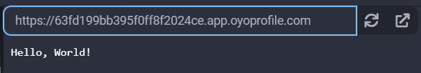
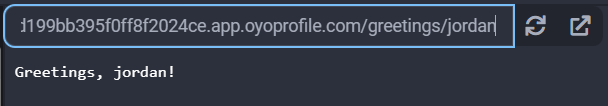

## Starlette

Starlette is an ASGI framework that allows for ease of building async web services in Python. To work properly, it must be used together with an ASGI server to run the service such as [Uvicorn](../uvicorn/).

### Examples

#### Basic ASGI Server

First install the uvicorn library, then paste the following into `main.py`:

```python
from starlette.applications import Starlette
from starlette.responses import PlainTextResponse
from starlette.routing import Route
import uvicorn


async def homepage(request):
    return PlainTextResponse('Hello, World!')


async def greeting(request):
    username = request.path_params['username']
    return PlainTextResponse(f'Greetings, {username}!')


app = Starlette(debug=True, routes=[
    Route('/', homepage),
    Route('/greetings/{username}', greeting)
])

if __name__ == '__main__':
    # host must be 0.0.0.0 to work in the Python3 Editor
    uvicorn.run(app, host='0.0.0.0', port=8000)
```

When you visit "/", you will see a page like this:


And when you visit "/greetings/jordan", you will see a page like this:


#### Handling POST requests

<div class="notebox notebox-info">
    <p class="notebox-title">
        Note
    </p>
    <p>
        To handle POST requests with Starlette, you need to have an additional library <a href="../python-multipart"><b>Python-Multipart</b></a> installed in your project. Then, we can access POST data with the <code>request.form()</code> method.
    </p>
</div>

Here's a project that creates a file upload input and returns the content as an undecoded string:

```python
from starlette.applications import Starlette
from starlette.responses import HTMLResponse, PlainTextResponse
from starlette.routing import Route
import uvicorn


async def homepage(request):
    return HTMLResponse('''
        <form action="/upload-file" method="post" enctype="multipart/form-data">
          <input type="file" name="file">
          <br>
          <input type="submit"/>
        </form>
    ''')


async def upload_file(request):
    form = await request.form()
    if 'file' in form and form['file']:
        file_content = await form['file'].read()
        return PlainTextResponse(str(file_content))
    return PlainTextResponse('no file uploaded')


app = Starlette(debug=True, routes=[
    Route('/', homepage),
    Route('/upload-file', upload_file, methods=['post'])
])


if __name__ == "__main__":
    uvicorn.run(app, host='0.0.0.0', port=8000)
```

Your output will vary depending on what file you upload, but a simple `.txt` file will print out similar to this:

```text
b"I'm uploading this text file.\r\n2nd line\r\n3rd line"
```

### Reference

-   [Starlette](https://www.starlette.io/) at _starlette.io_
