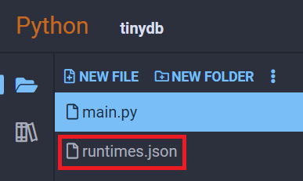

## TinyDB

TinyDB is a database package for Python written entirely in Python with a focus on providing a simple database solution for simple programs without the need for an extra external database server like Mongo.

You should use TinyDB if you only need to track a small amount of data across separate runs of a program. If you need advanced features like concurrent access or handling data for an HTTP server, you should use a more robust database package like Mongo or SQLite.

### Examples

#### Record Runtimes

```python
import time
from tinydb import TinyDB

db = TinyDB('runtimes.json')
db.insert({"runtime": time.time()})
for entry in iter(db):
    print(entry)
```

Each time you run this program, another entry with the key `runtime` will be inserted with the current `time.time()`, and all the previous times the program was ran will also be printed.

First run:

```text
{'runtime': 1678895895.8667424}
```

Second run:

```text
{'runtime': 1678895895.8667424}
{'runtime': 1678895897.6668615}
```

<div class="notebox notebox-info">
    <p class="notebox-title">
        Note
    </p>
    <p>
        When you try to open a database that doesn't exist, it will automatically be created and put into your filelist. Since we used <code>'runtimes.json'</code> in our code above, you can see it added in your project's file list to the left: 
    </p>
    <p>
        
    </p>
</div>

#### Search Database Entries

We can search through our database and only pull certain values that meet some specific critera with a **Query**:

```python
from tinydb import TinyDB, Query

db = TinyDB('marbles.json')
# db.truncate() deletes the entire contents of database.
# This is just an example. Don't do this if you want to keep your data!
db.truncate()

db.insert({'color': 'red', 'count': 1})
db.insert({'color': 'green', 'count': 2})
db.insert({'color': 'blue', 'count': 3})
db.insert({'color': 'orange', 'count': 4})
db.insert({'color': 'purple', 'count': 5})

marbles = Query()
for entry in db.search(marbles.count >= 3):
    print(entry)
```

Output:

```text
{'color': 'blue', 'count': 3}
{'color': 'orange', 'count': 4}
{'color': 'purple', 'count': 5}
```

#### Update Entry in Database

We can also use **Query** to select a certain document or documents to update. The following code creates an `animals.json`, inserts two items, and then adds 10 to animals with the type "dog":

```python
from tinydb import TinyDB, Query
from tinydb.operations import add

db = TinyDB('animals.json')
# db.truncate() deletes the entire contents of database.
# This is just an example. Don't do this if you want to keep your data!
db.truncate()
db.insert({'type': 'cat', 'count': 5})
db.insert({'type': 'dog', 'count': 5})

animals = Query()
db.update(add('count', 10), animals.type == 'dog')
for entry in iter(db):
    print(entry)
```

Output:

```text
{'type': 'cat', 'count': 5}
{'type': 'dog', 'count': 15}
```

### Reference

-   [TinyDB](https://tinydb.readthedocs.io/en/latest/index.html) at _tinydb.readthedocs.io_
