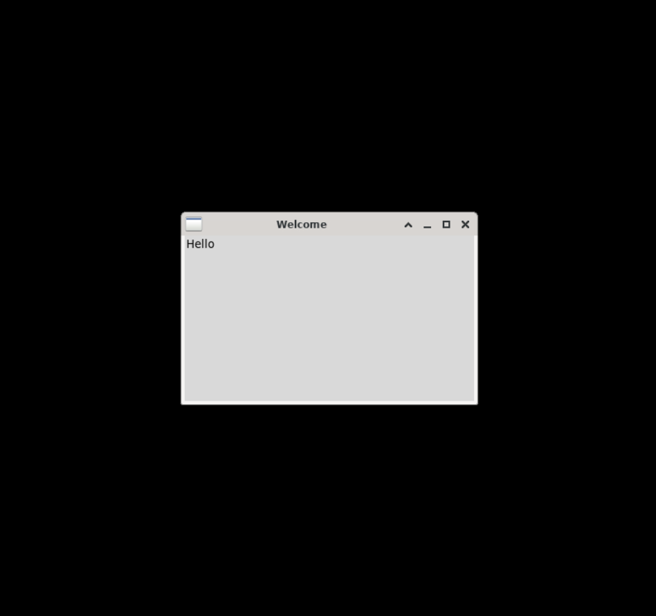

## tkinter
Tkinter is a GUI framework that is built into the Python Standard Library. This framework works cross-platform so it works regardless of OS.

### Quick Example

#### Simple Message Box

```python
from tkinter import *
# create a window instance
window = Tk()
# set window title
window.title("Welcome")
# set window size: 350 x 200
window.geometry("350x200")
# create a text label
lbl = Label(window, text="Hello")
# show the label at top-left corner
lbl.grid(column=0, row=0)
# show this window
window.mainloop()
```

Copy the above code to the Python3 IDE in OYOclass, then click "Run", you will see a running result like the following:



### Reference

-   [Tkinter Module](https://docs.python.org/3/library/tkinter.html#tkinter-modules) at _docs.python.org_