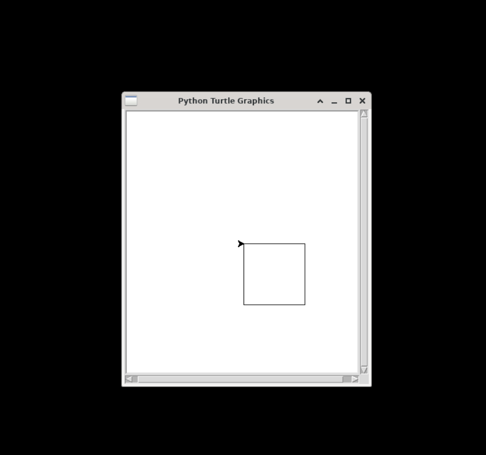
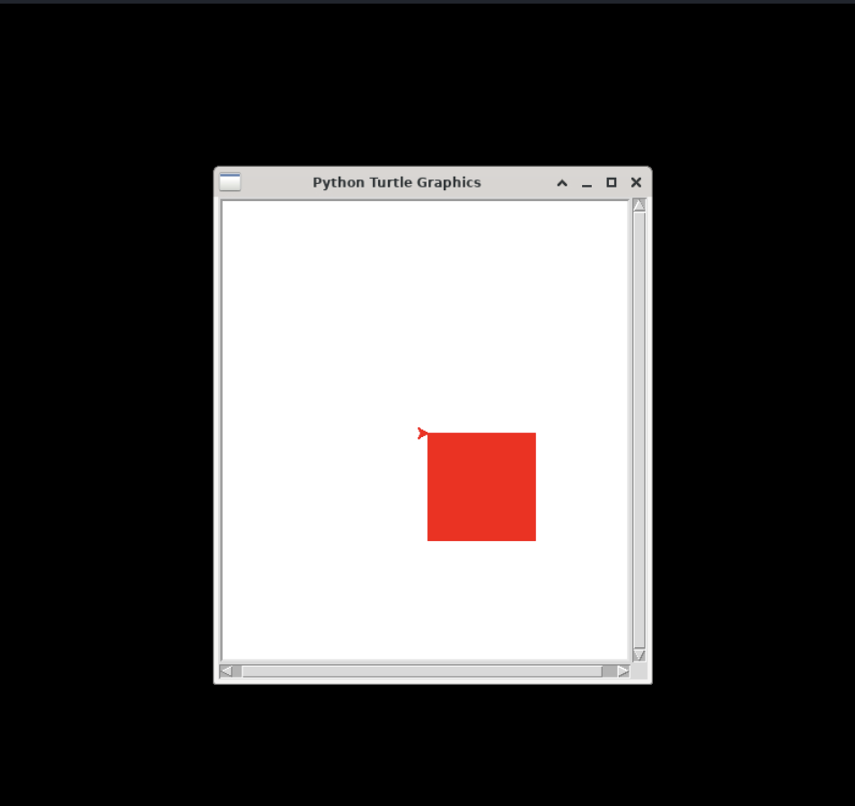

## turtle — Turtle Graphic Library

The `turtle` library is a popular library for drawing simple graphics.

### Quick Examples

#### Draw a Square

```python
from turtle import *

t = Turtle()

for i in range(4):
    t.forward(100)
    t.right(90)

done()
```

Please note that you must call the `done()` function at the end, otherwise the drawing window will be closed automatically after drawing and you may not be able to see the drawings.

Copy the above code to the Python3 IDE in OYOclass, then click "Run", and you will see a running result like the following:



#### Draw with a Fill Color

```python
from turtle import *

t = Turtle()

t.color("red")
t.begin_fill()
for i in range(4):
    t.forward(100)
    t.right(90)
t.end_fill()

done()
```

Copy the above code to the Python3 IDE in OYOclass, then click "Run", and you will see a running result like the following:



### Reference

-   [Turtle Module](https://docs.python.org/3/library/turtle.html) at _docs.python.org_
